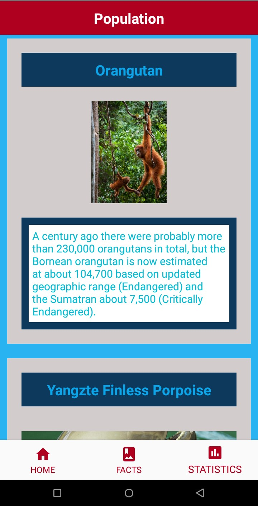

# the-endangered-animals
An android application listing the endangered animals, information and facts regarding them and the steps taken to save them by WWF.</br>

    </br>

## Using Circle Image View
- For rendering Image View in circular shape, add the following dependencies to gradle file :

```
dependencies {
  implementation 'de.hdodenhof:circleimageview:3.1.0'
}
```
- Usage
```
<de.hdodenhof.circleimageview.CircleImageView
    android:id="@+id/profile_image"
    android:layout_width="100sp"
    android:layout_height="100sp"
    android:src="@drawable/profile"
    app:civ_border_width="2dp"
    app:civ_border_color="#FF000000"/>        
 ```       
 
 <strong>For more information refer </strong><a href = "https://github.com/hdodenhof/CircleImageView" target = "_blank" id = "reference link">https://github.com/hdodenhof/CircleImageView</a></br></br>

<p align = "center">

</p></br>

    </br></br>

## Implementation of zoomable Android Image View 
*PhotoView aims to help produce an easily usable implementation of a zooming Android ImageView.*</br>

- For using Photoview, add the following dependency in root `build.gradle` i.e. `build.gradle(Project: ProjectName)`
```
allprojects {
	repositories {
        maven { url "https://jitpack.io" }
    }
}
```
- And add the following library to module `build.gradle` i.e. `build.gradle(Module: app)`
```
dependencies {
    implementation 'com.github.chrisbanes:PhotoView:2.1.3'
}
```
### Usage

```
<com.github.chrisbanes.photoview.PhotoView
        android:id="@+id/photoView"
        android:layout_width="match_parent"
        android:layout_height="match_parent"/>
```    

```
PhotoView photoView = (PhotoView) findViewById(R.id.photo_view);
photoView.setImageResource(R.drawable.image);
```
<p align = "center">

</p></br>

<strong>For more information refer </strong><a href = "https://github.com/chrisbanes/PhotoView" target = "_blank" id = "reference-link">https://github.com/chrisbanes/PhotoView</a></br>

## Saving endangered animals
- Protecting Wildlife habitats
- Staying away from pesticides and herbicides
- Volunteer your time to protect the wildlife
- Recycling and buying sustainable products
- Being ethical tourist, educating and awaring others


>Each and every animal on earth has as much right to be here as much as you and me.
